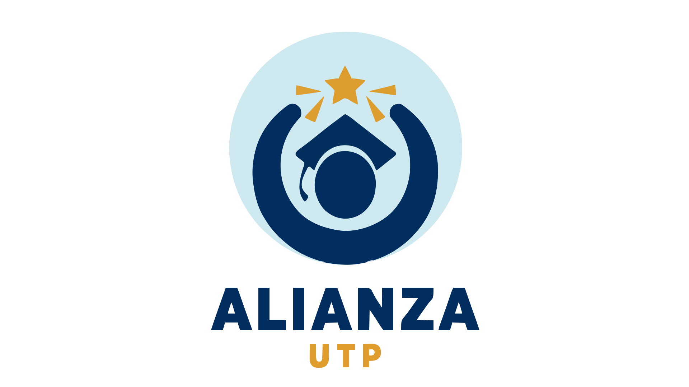

[
# Alianza UTP
**_Tu plataforma estudiantil para reunir, planear y crecer._**

---

## Tabla de Contenido

1. [Descripción General](#descripción-general)
2. [Funcionalidades Principales](#funcionalidades-principales)
3. [Estructura del Proyecto](#estructura-del-proyecto)
4. [Tecnologías Usadas](#tecnologías-usadas)
5. [Requisitos de Entorno](#requisitos-de-entorno)
6. [Instalación](#instalación)
   - [Clonar el repositorio](#1-clonar-el-repositorio)
   - [Configuración de servicios externos](#2-configuración-de-servicios-externos)
     - [Servidor SMTP y DNS](#servidor-smtp-y-dns)
     - [API de Imgur](#api-de-imgur)
7. [Modo de Uso](#modo-de-uso)
8. [Validación Inicial](#validación-inicial)
9. [Contribuciones](#contribuciones)
10. [Autores](#autores)
11. [Licencia](#licencia)
12. [Notas Adicionales](#notas-adicionales)

---

## Descripción General

**Alianza UTP** es una aplicación web multicapa que facilita la gestión de actividades académicas y grupos estudiantiles. El sistema está dirigido a estudiantes y organizadores, permitiendo la administración eficiente de eventos, grupos y notificaciones.

**¿Qué problema resuelve?**  
Centraliza la gestión de actividades y grupos, evitando la dispersión de información y mejorando la comunicación entre usuarios.

**Usuarios principales:**  
- Estudiantes  
- Organizadores/Administradores

---

## Funcionalidades Principales

1. **CRUD de Actividades**
   - Registro, edición y cancelación de actividades académicas.
   - Validación en tiempo real y almacenamiento vía API REST.

2. **Gestión de Grupos**
   - Catálogo de grupos por área de interés.
   - Inscripción y desinscripción de usuarios con confirmación automática.

3. **Búsqueda y Notificaciones**
   - Filtros avanzados por tipo, fecha y palabras clave.
   - Recordatorios y alertas automáticas sobre cambios en eventos.

---
## Estructura del Proyecto

La organización de carpetas es la siguiente:

```
repositorio-vue/
│
├── backend/               # API REST en Flask (Python)
│   ├── controllers/       # Lógica de negocio y endpoints
│   ├── utils/             # Funciones de seguridad y helpers
│   ├── app.py             # Entrada principal del backend
│   └── ...
│
├── database/              # Base de datos
│   ├── schema/            # Scripts de creación de tablas y relaciones
│   ├── catalogs/         # Scripts de inserción de datos de catálogo
│   ├── functions/         # Scripts de funciones para el backend
│   ├── Procedures/    # Scripts de procedimientos almacenados
│   ├── triggers/          # Scripts de triggers
│   └── ...
│
├── frontend/              # Aplicación Vue 3 + TypeScript
│   ├── src/               # Componentes, vistas y lógica de negocio
│   ├── assets/            # Recursos estáticos
│   └── ...
│
├── README.md              # Documentación principal
└── ...
```

---

## Tecnologías Usadas

<p align="left">
   
   
   
   
   
   
   
   
</p>

- **Frontend:** Vue 3, TypeScript, Vite, Pinia, TailwindCSS  
- **Backend:** Flask (Python)  
- **Base de datos:** PostgreSQL  
- **Herramientas:** Node.js, pnpm, git

---

## Requisitos de Entorno

- **Node.js** ≥ 16
- **pnpm** (o npm)
- **Python** ≥ 3.8
- **git**

---

## Instalación

### 1. Clonar el repositorio

```bash
git clone https://github.com/VirgilioS-Collab/repositorio-vue.git
cd gestor_academico
```
### 2. Configuración de servicios externos

Para habilitar el envío de correos electrónicos y la gestión de imágenes, es necesario configurar los siguientes servicios:

#### Servidor SMTP y DNS

- **SMTP:** Debes contar con acceso a un servidor SMTP válido para enviar correos electrónicos desde la aplicación. Configura los parámetros (`MAIL_SERVER`, `MAIL_PORT`, `MAIL_USERNAME`, `MAIL_PASSWORD`, etc.) en el archivo `.env` del backend.
- **DNS:** Para enviar correos a destinatarios externos (fuera de tu dominio), asegúrate de que el dominio utilizado tenga los registros DNS apropiados (SPF, DKIM y DMARC) configurados. Esto ayuda a evitar que los correos sean marcados como spam y garantiza la entrega correcta.

#### API de Imgur

- **Cuenta Imgur:** Es necesario crear una cuenta en [Imgur](https://api.imgur.com/) y registrar una aplicación para obtener las credenciales (`IMGUR_CLIENT_ID`, `IMGUR_CLIENT_SECRET`). Estas credenciales deben agregarse al archivo `.env` del backend para habilitar la subida y gestión de imágenes.

> **Nota:** No compartas ni subas tus archivos `.env` con credenciales sensibles al repositorio público.

---

## Modo de Uso

- Inicia el backend y frontend como se indica en la sección de instalación.
- Accede a la aplicación en [http://localhost:5173](http://localhost:5173).
- Utiliza la interfaz web para explorar las funcionalidades principales (gestión de actividades, grupos y notificaciones).
- Si necesitas probar endpoints del backend, consulta la documentación interna de la API o utiliza herramientas como Postman para realizar solicitudes a los endpoints disponibles.
- No se incluye una API de ejemplo; asegúrate de configurar correctamente el entorno y la base de datos antes de realizar pruebas.

---

## Validación Inicial

La vista principal (`frontend/src/views/Home.vue`) incluye un componente `Navbar` y un mensaje placeholder para verificar el arranque correcto:

```vue
<template>
  <Navbar />
  <main class="main-content">
    <h1>Alianza UTP</h1>
    <p>Inicio cargado correctamente.</p>
  </main>
</template>
```

---

## Contribuciones

Las contribuciones son bienvenidas.  
1. Haz un fork del repositorio.
2. Crea una rama para tu mejora.
3. Realiza tus cambios y envía un pull request.

---

## Autores

| Nombre              | Rol(es)                                                                                                   | GitHub                                               |
|---------------------|-----------------------------------------------------------------------------------------------------------|------------------------------------------------------|
| Luis Boniche        | Frontend Developer, diseño de UI/UX, desarrollo de componentes y lógica de integración en el cliente.     | [@ConnorDarghaoui](https://github.com/ConnorDarghaoui)   |
| Cristhian Arroyo    | Backend Developer, diseño de API REST, modelado de base de datos relacional y despliegue en entorno de servidor. | [@carroyo5](https://github.com/carroyo5)             |
| Virgilio Saldaña    | QA Engineer, testing funcional, administración de bases de datos y documentación técnica.                | [@VirgilioS-Collab](https://github.com/VirgilioS-Collab) |
| Alejandro Tulipano  | Database Engineer, análisis de rendimiento, optimización de consultas y diseño de estructuras relacionales. | *(enlace no disponible)*                             |


> *¿Quieres aparecer aquí? ¡Contribuye y agrega tu nombre en el próximo pull request!*

---

## Licencia

Este proyecto está bajo la licencia MIT.

---

## Notas Adicionales

- Créditos a los estudiantes que participaron en la definición de requisitos.
- Para dudas o soporte, abre un issue en [GitHub Issues](https://github.com/VirgilioS-Collab/repositorio-vue/issues) y el equipo responderá lo antes posible.
- Si tienes sugerencias, comentarios o encuentras algún error, no dudes en comunicarte. Tu aporte es fundamental para mejorar la plataforma.

---

¡Gracias por tu interés en Alianza UTP!  
Esperamos que esta herramienta te ayude a potenciar tu experiencia académica y colaborativa.  
¡Juntos construimos una comunidad universitaria más conectada y eficiente!](https://github-readme-stats.vercel.app/api?username=carroyo5&show_icons=true&theme=default&title_color=5da0d7&text_color=936daa&icon_color=cd9af9&bg_color=f2f2f2)
