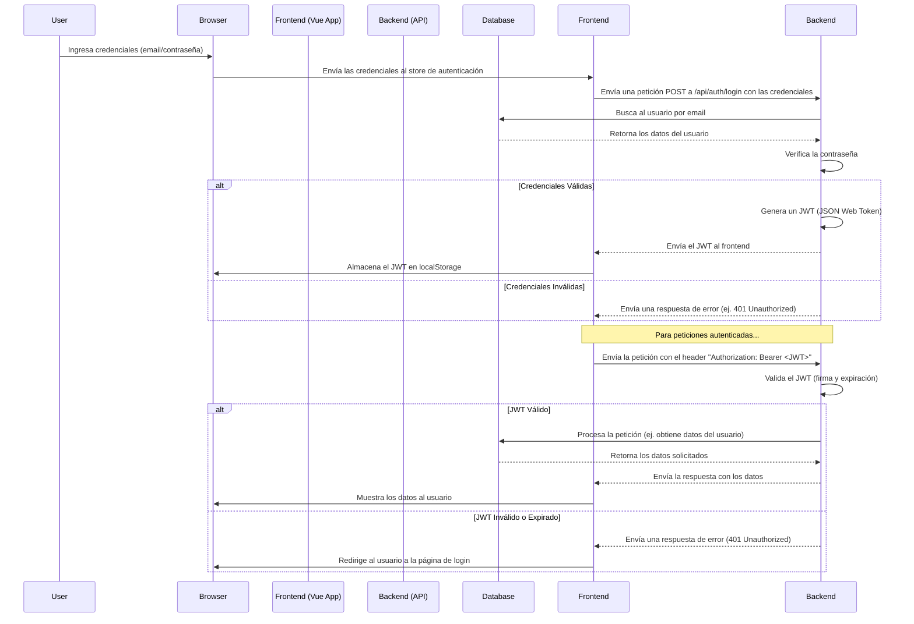

# Alianza UTP - Frontend

## Descripción General

Este repositorio contiene el código fuente del frontend de **Alianza UTP**, una plataforma web diseñada para la gestión de clubes y actividades estudiantiles. La aplicación permite a los estudiantes descubrir y unirse a clubes, participar en actividades y gestionar su perfil. A su vez, ofrece a los administradores de clubes un panel completo para gestionar miembros, finanzas, eventos y la configuración de su club.

Construido como una **Single Page Application (SPA)**, utiliza un stack moderno basado en **Vue.js 3** y **TypeScript**, garantizando una experiencia de usuario rápida, reactiva y mantenible.

## Arquitectura y Diseño Técnico

Este diagrama ilustra una arquitectura de aplicación web moderna y desacoplada, donde el frontend (la aplicación de una sola página o SPA) y el backend son sistemas independientes que se comunican a través de una API.

```mermaid
graph TD
    subgraph "Navegador del Usuario"
        User[<fa:fa-user> Usuario]
    end

    subgraph "Frontend (Vue.js SPA)"
        Views[<fa:fa-desktop> Vistas y Componentes (.vue)]
        Router[<fa:fa-route> Vue Router]
        Store[<fa:fa-database> Pinia Store]
        Services[<fa:fa-cogs> Servicios/DAO (Axios)]
    end

    subgraph "Backend"
        API[<fa:fa-server> API Server (Node.js/Python/etc.)]
        Database[<fa:fa-database> Base de Datos (PostgreSQL/MongoDB/etc.)]
    end

    %% Flujo de Petición y Datos
    User -- "1. Interactúa con la UI" --> Views
    Views -- "2. Despacha acción o navega" --> Router
    Views -- "3. Llama a una acción del store" --> Store
    Router -- "4. Renderiza la vista apropiada" --> Views
    Store -- "5. Llama al servicio apropiado" --> Services
    Services -- "6. Realiza petición HTTP a la API" --> API
    API -- "7. Procesa y consulta la DB" --> Database
    Database -- "8. Retorna datos" --> API
    API -- "9. Envía respuesta JSON" --> Services
    Services -- "10. Procesa la respuesta" --> Store
    Store -- "11. Actualiza el estado" --> Views
```

### Flujo de Autenticación JWT



### Estructura de Directorios
```
/
├── public/             # Activos estáticos que no se procesan
├── src/
│   ├── assets/         # Imágenes, logos y otros recursos estáticos
│   ├── components/     # Componentes de Vue reutilizables
│   │   ├── common/     # Componentes genéricos (botones, inputs)
│   │   ├── modals/     # Componentes para ventanas modales
│   │   ├── ui/         # Componentes de UI más complejos (cards, charts)
│   │   └── widgets/    # Componentes para el dashboard (calendario, notificaciones)
│   ├── composables/    # Lógica reutilizable con la Composition API de Vue
│   ├── constants/      # Constantes de la aplicación (rutas, endpoints)
│   ├── layouts/        # Diseños de página principales (Default, Admin)
│   ├── router/         # Configuración de Vue Router y guards de navegación
│   ├── services/       # Lógica de negocio y comunicación con la API
│   │   └── dao/        # Data Access Objects para las entidades de la API
│   │       └── models/ # Tipos de TypeScript para los datos
│   ├── store/          # Módulos de estado global con Pinia
│   ├── utils/          # Funciones de utilidad
│   └── views/          # Componentes de página (asociados a rutas)
│       ├── auth/       # Vistas de autenticación
│       ├── club/       # Vistas del panel de administración del club
│       └── user/       # Vistas para el usuario general
├── .env.development    # Variables de entorno para desarrollo
├── index.html          # Punto de entrada HTML
├── package.json        # Dependencias y scripts del proyecto
└── vite.config.ts      # Configuración de Vite
```

## Características Principales

### Para Estudiantes
- **Autenticación Segura:** Registro, inicio de sesión y recuperación de contraseña mediante un flujo basado en tokens (JWT).
- **Exploración de Clubes y Actividades:** Un catálogo completo para buscar y filtrar clubes y actividades de interés.
- **Perfiles Detallados:** Vistas detalladas para cada club y actividad con toda la información relevante.
- **Gestión de Perfil de Usuario:** Los usuarios pueden ver y actualizar la información de su perfil.
- **Mis Actividades:** Una sección personalizada donde los usuarios pueden ver las actividades en las que están inscritos.

### Para Administradores de Club
- **Panel de Control (Dashboard):** Visualización de estadísticas clave y actividades recientes del club.
- **Gestión de Miembros:** Administrar la lista de miembros, roles y solicitudes de unión.
- **Gestión de Actividades:** Crear, editar y eliminar actividades del club.
- **Gestión Financiera:** Un apartado para llevar un registro de las finanzas del club.
- **Configuración del Club:** Actualizar la información pública y los ajustes del club.

## Stack Tecnológico

- **Framework Principal:** [Vue.js 3](https://vuejs.org/) (con Composition API)
- **Lenguaje:** [TypeScript](https://www.typescriptlang.org/)
- **Enrutador:** [Vue Router](https://router.vuejs.org/)
- **Gestión de Estado:** [Pinia](https://pinia.vuejs.org/)
- **Estilos:** [Tailwind CSS](https://tailwindcss.com/)
- **Herramienta de Build:** [Vite](https://vitejs.dev/)
- **Testing:** [Vitest](https://vitest.dev/)
- **Cliente HTTP:** [Axios](https://axios-http.com/)

## Cómo Empezar

### Prerrequisitos

- Node.js (versión 22 o superior recomendada)
- pnpm (gestor de paquetes)

### Instalación

1.  **Clonar el repositorio:**
    ```bash
    git clone <URL_DEL_REPOSITORIO>
    cd frontend
    ```

2.  **Instalar dependencias:**
    ```bash
    pnpm install
    ```

3.  **Configurar variables de entorno:**
    Crea un archivo `.env.development` en la raíz del proyecto, basándote en `.env.example` (si existe) o añadiendo las siguientes variables:
    ```
    VITE_API_BASE_URL=http://localhost:8080/api
    ```

### Ejecutar en Desarrollo

Para iniciar el servidor de desarrollo con hot-reload:

```bash
pnpm dev
```
La aplicación estará disponible en `http://localhost:5173`.

## Scripts Disponibles

- `pnpm dev`: Inicia el servidor de desarrollo.
- `pnpm build`: Compila y empaqueta la aplicación para producción.
- `pnpm preview`: Sirve la build de producción localmente para previsualización.
- `pnpm test`: Ejecuta los tests unitarios.

## Contribuciones

Las contribuciones son bienvenidas. Por favor, sigue los siguientes pasos para contribuir:

1.  Haz un fork del repositorio.
2.  Crea una nueva rama para tu feature (`git checkout -b feature/nueva-funcionalidad`).
3.  Haz tus cambios y commitea (`git commit -am 'Añade nueva funcionalidad'`).
4.  Haz push a tu rama (`git push origin feature/nueva-funcionalidad`).
5.  Crea un nuevo Pull Request.

## Licencia

Este proyecto está bajo la Licencia MIT. Consulta el archivo `LICENSE` para más detalles.